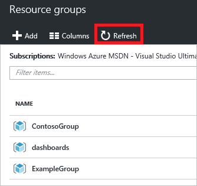
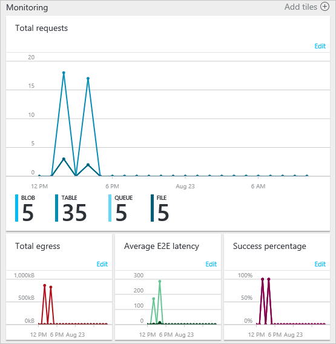
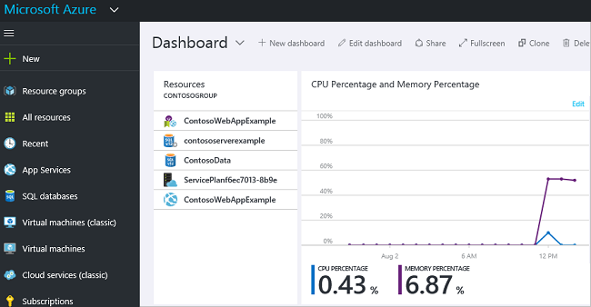
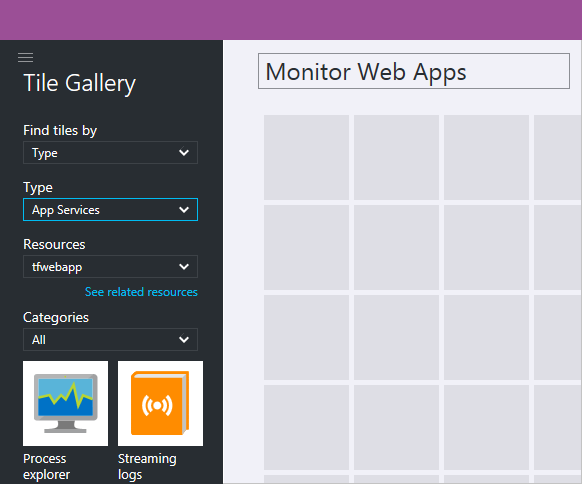
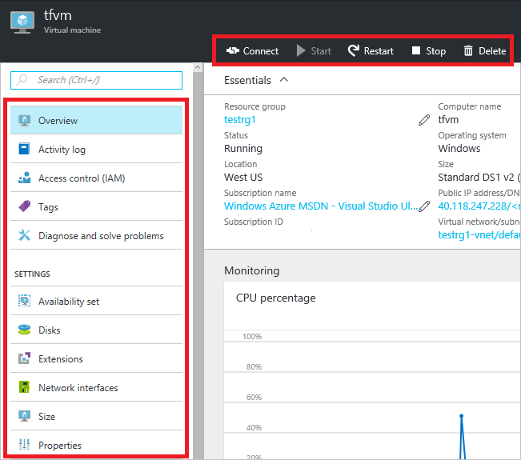

<properties 
	pageTitle="Use Azure portal to manage Azure resources | Microsoft Azure" 
	description="Use Azure portal and Azure Resource Manage to manage your resources. Shows how to work with dashboards to monitor resources." 
	services="azure-resource-manager,azure-portal" 
	documentationCenter="" 
	authors="tfitzmac" 
	manager="timlt" 
	editor="tysonn"/>

<tags 
	ms.service="azure-resource-manager" 
	ms.workload="multiple" 
	ms.tgt_pltfrm="na" 
	ms.devlang="na" 
	ms.topic="article" 
	ms.date="09/12/2016" 
	ms.author="tomfitz"/>

# Manage Azure resources through portal

> [AZURE.SELECTOR]
- [Azure PowerShell](../powershell-azure-resource-manager.md)
- [Azure CLI](../xplat-cli-azure-resource-manager.md)
- [Portal](resource-group-portal.md) 
- [REST API](../resource-manager-rest-api.md)

This topic shows how to use the [Azure portal](https://portal.azure.com) with [Azure Resource Manager](../azure-resource-manager/resource-group-overview.md) to manage your Azure resources. To learn about deploying resources through the portal, see [Deploy resources with Resource Manager templates and Azure portal](../resource-group-template-deploy-portal.md).

Currently, not every service supports the portal or Resource Manager. For those services, you need to use the [classic portal](https://manage.windowsazure.com). For the status of each service, see [Azure portal availability chart](https://azure.microsoft.com/features/azure-portal/availability/).

## Manage resource groups

1. To see all the resource groups in your subscription, select **Resource groups**.

    

1. To create an empty resource group, select **Add**.

    

1. Provide a name and location for the new resource group. Select **Create**.

    

1. You may need to select **Refresh** to see the recently created resource group.

    

1. To customize the information displayed for your resource groups, select **Columns**.

    

1. Select the columns to add, and then select **Update**.

    

1. To learn about deploying resources to your new resource group, see [Deploy resources with Resource Manager templates and Azure portal](../resource-group-template-deploy-portal.md).

1. For quick access to a resource group, you can pin the blade to your dashboard.

    

1. The dashboard displays the resource group and its resources. You can select either the resource groups or any of its resources to navigate to the item.

    

## Tag resources

You can apply tags to resource groups and resources to logically organize your assets. For information about working with tags, see [Using tags to organize your Azure resources](../resource-group-using-tags.md).

[AZURE.INCLUDE [resource-manager-tag-resource](../../includes/resource-manager-tag-resources.md)]

## Monitor resources

When you select a resource, the resource blade presents default graphs and tables for monitoring that resource type.

1. Select a resource and notice the **Monitoring** section. It includes graphs that are relevant to the resource type. The following image shows the default monitoring data for a storage account.

    

1. You can pin a section of the blade to your dashboard by selecting the ellipsis (...) above the section. You can also customize the size the section in the blade or remove it completely. The following image shows how to pin, customize, or remove the CPU and Memory section.

    

1. After pinning the section to the dashboard, you will see the summary on the dashboard. And, selecting it immediately takes you to more details about the data.

    

1. To completely customize the data you monitor through the portal, navigate to your default dashboard, and select **New dashboard**.

    

1. Give your new dashboard a name and drag tiles onto the dashboard. The tiles are filtered by different options.

    

     To learn about working with dashboards, see [Creating and sharing dashboards in the Azure portal](azure-portal-dashboards.md).

## Manage resources

In the blade for a resource, you see the options for managing the resource. The portal presents management options for that particular resource type. You see the management commands across the top of the resource blade and on the left side.

From these options, you can perform operations such as starting and stopping a virtual machine, or reconfiguring the properties of the virtual machine.

## Move resources

If you need to move resources to another resource group or another subscription, see [Move resources to new resource group or subscription](../resource-group-move-resources.md).

## Lock resources

You can lock a subscription, resource group, or resource to prevent other users in your organization from accidentally deleting or modifying critical resources. For more information, see [Lock resources with Azure Resource Manager](../resource-group-lock-resources.md).

[AZURE.INCLUDE [resource-manager-lock-resources](../../includes/resource-manager-lock-resources.md)]

## View your subscription and costs

You can view information about your subscription and the rolled-up costs for all your resources. Select **Subscriptions** and the subscription you want to see. You might only have one subscription to select.

Within the subscription blade, you see a burn rate.

And, a breakdown of costs by resource type.

## Export template

After setting up your resource group, you may want to view the Resource Manager template for the resource group. Exporting the template offers two benefits:

1. You can easily automate future deployments of the solution because the template contains all the complete infrastructure.

2. You can become familiar with template syntax by looking at the JavaScript Object Notation (JSON) that represents your solution.

For step-by-step guidance, see [Export Azure Resource Manager template from existing resources](../resource-manager-export-template.md).

## Delete resource group or resources

Deleting a resource group deletes all the resources contained within it. You can also delete individual resources within a resource group. You want to exercise caution when you delete a resource group because there might be resources in other resource groups that are linked to it. Resource Manager does not delete linked resources, but they may not operate correctly without the expected resources.

## Next Steps

- To view audit logs, see [Audit operations with Resource Manager](../resource-group-audit.md).
- To troubleshoot deployment errors, see [Troubleshooting resource group deployments with Azure portal](../resource-manager-troubleshoot-deployments-portal.md).
- To deploy resources through the portal, see [Deploy resources with Resource Manager templates and Azure portal](../resource-group-template-deploy-portal.md).
- To manage access to resources, see [Use role assignments to manage access to your Azure subscription resources](../active-directory/role-based-access-control-configure.md).
- For guidance on how enterprises can use Resource Manager to effectively manage subscriptions, see [Azure enterprise scaffold - prescriptive subscription governance](../resource-manager-subscription-governance.md).

