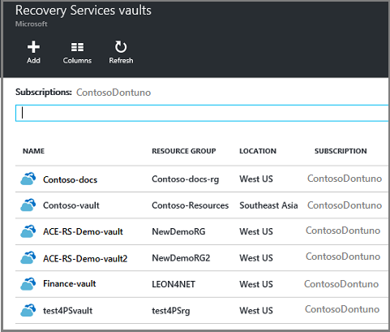
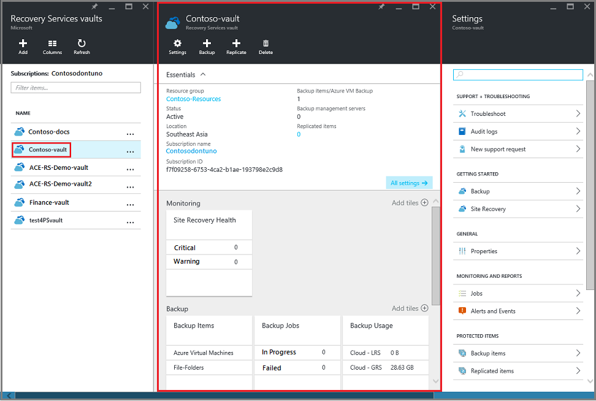
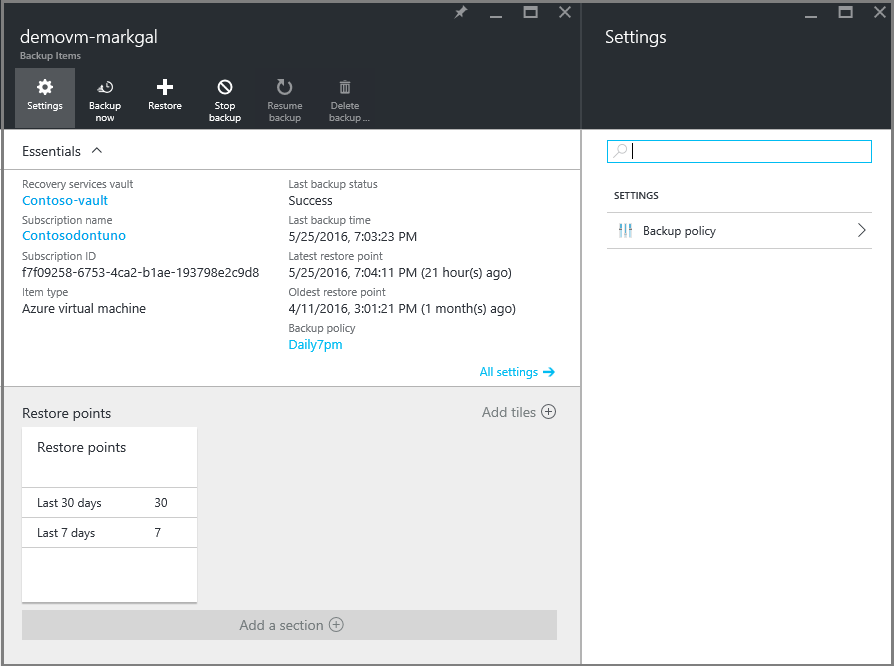
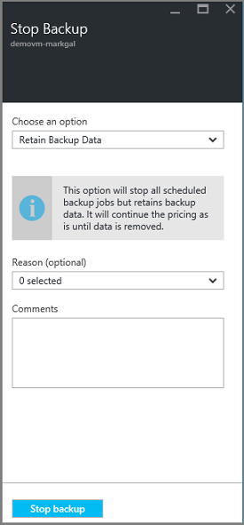
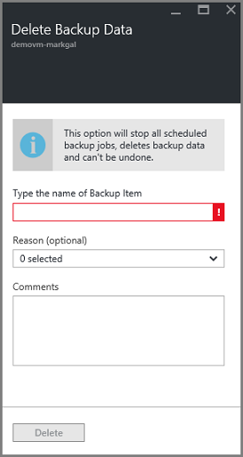

<properties
	pageTitle="Manage Resource Manager-deployed virtual machine backups | Microsoft Azure"
	description="Learn how to manage and monitor Resource Manager-deployed virtual machine backups"
	services="backup"
	documentationCenter=""
	authors="trinadhk"
	manager="shreeshd"
	editor=""/>

<tags
	ms.service="backup"
	ms.workload="storage-backup-recovery"
	ms.tgt_pltfrm="na"
	ms.devlang="na"
	ms.topic="article"
	ms.date="08/11/2016"
	ms.author="jimpark; markgal; trinadhk"/>

# Manage Azure virtual machine backups

> [AZURE.SELECTOR]
- [Manage Azure VM backups](backup-azure-manage-vms.md)
- [Manage Classic VM backups](backup-azure-manage-vms-classic.md)

This article provides guidance on managing VM backups, and explains the backup alerts information available in the portal dashboard. The guidance in this article applies to using VMs with Recovery Services vaults. This article does not cover the creation of virtual machines, nor does it explain how to protect virtual machines. For a primer on protecting Azure Resource Manager-deployed VMs in Azure with a Recovery Services vault, see [First look: Back up VMs to a Recovery Services vault](backup-azure-vms-first-look-arm.md).

## Manage vaults and protected virtual machines

In the Azure portal, the Recovery Services vault dashboard provides access to information about the vault including:

- the most recent backup snapshot, which is also the latest restore point <br\>
- the backup policy <br\>
- total size of all backup snapshots <br\>
- number of virtual machines that are protected with the vault <br\>

Many management tasks with a virtual machine backup begin with opening the vault in the dashboard. However, because vaults can be used to protect multiple items (or multiple VMs), to view details about a particular VM, open the vault item dashboard. The following procedure shows you how to open the *vault dashboard* and then continue to the *vault item dashboard*. There are "tips" in both procedures that point out how to add the vault and vault item to the Azure dashboard by using the Pin to dashboard command. Pin to dashboard is a way of creating a shortcut to the vault or item. You can also execute common commands from the shortcut.

>[AZURE.TIP] If you have multiple dashboards and blades open, use the dark-blue slider at the bottom of the window to slide the Azure dashboard back and forth.

### Open a Recovery Services vault in the dashboard:

1. Sign in to the [Azure portal](https://portal.azure.com/).

2. On the Hub menu, click **Browse** and in the list of resources, type **Recovery Services**. As you begin typing, the list filters based on your input. Click **Recovery Services vault**.

      

    The list of Recovery Services vaults are displayed.

      

    >[AZURE.TIP] If you pin a vault to the Azure Dashboard, that vault is immediately accessible when you open the Azure portal. To pin a vault to the dashboard, in the vault list, right-click the vault, and select **Pin to dashboard**.

3. From the list of vaults, select the vault to open its dashboard. When you select the vault, the vault dashboard and the **Settings** blade open. In the following image, the **Contoso-vault** dashboard is highlighted.

    

### Open a vault item dashboard

In the previous procedure you opened the vault dashboard. To open the vault item dashboard:

1. In the vault dashboard, on the **Backup Items** tile, click **Azure Virtual Machines**.

    

    The **Backup Items** blade lists the last backup job for each item. In this example, there is one virtual machine, demovm-markgal, protected by this vault.  

    

    >[AZURE.TIP] For ease of access, you can pin a vault item to the Azure Dashboard. To pin a vault item, in the vault item list, right-click the item and select **Pin to dashboard**.

2. In the **Backup Items** blade, click the item to open the vault item dashboard.

    

    The vault item dashboard and its **Settings** blade open.

    

    From the vault item dashboard, you can accomplish many key management tasks, such as:

    - change policies or create a new backup policy<br\>
	- view restore points, and see their consistency state <br\>
	- on-demand backup of a virtual machine <br\>
	- stop protecting virtual machines <br\>
	- resume protection of a virtual machine <br\>
	- delete a backup data (or recovery point) <br\>
	- [restore a backup (or recovery point)](./backup-azure-arm-restore-vms.md#restore-a-recovery-point)  <br\>

For the following procedures, the starting point is the vault item dashboard.

## Manage backup policies

1. On the [vault item dashboard](backup-azure-manage-vms.md#open-a-vault-item-dashboard), click **All Settings** to open the **Settings** blade.

    

2. On the **Settings** blade, click **Backup policy** to open that blade.

    On the blade, the backup frequency and retention range details are shown.

    

3. From the **Choose backup policy** menu:
    - To change policies, select a different policy and click **Save**. The new policy is immediately applied to the vault. <br\>
    - To create a policy, select **Create New**.

    

    For instructions on creating a backup policy, see [Defining a backup policy](backup-azure-manage-vms.md#defining-a-backup-policy).

[AZURE.INCLUDE [backup-create-backup-policy-for-vm](../../includes/backup-create-backup-policy-for-vm.md)]

## On-demand backup of a virtual machine
You can take an on-demand backup of a virtual machine once it is configured for protection. If the initial backup is pending, on-demand backup creates a full copy of the virtual machine in the Recovery Services vault. If the initial backup is completed, an on-demand backup will only send changes from the previous snapshot, to the Recovery Services vault. That is, subsequent backups are always incremental.

>[AZURE.NOTE] The retention range for an on-demand backup is the retention value specified for the Daily backup point in the policy. If no Daily backup point is selected, then the weekly backup point is used.

To trigger an on-demand backup of a virtual machine:

- On the [vault item dashboard](backup-azure-manage-vms.md#open-a-vault-item-dashboard), click **Backup now**.

    

    The portal makes sure that you want to start an on-demand backup job. Click **Yes** to start the backup job.

    

    The backup job creates a recovery point. The retention range of the recovery point is the same as retention range specified in the policy associated with the virtual machine. To track the progress for the job, in the vault dashboard, click the **Backup Jobs** tile.  

## Stop protecting virtual machines
If you choose to stop protecting a virtual machine, you are asked if you want to retain the recovery points. There are two ways to stop protecting virtual machines:
- stop all future backup jobs and delete all recovery points, or
- stop all future backup jobs but leave the recovery points  

There is a cost associated with leaving the recovery points in storage. However, the benefit of leaving the recovery points is you can restore the virtual machine later, if desired. For information about the cost of leaving the recovery points, see the  [pricing details](https://azure.microsoft.com/pricing/details/backup/). If you choose to delete all recovery points, you cannot restore the virtual machine.

To stop protection for a virtual machine:

1. On the [vault item dashboard](backup-azure-manage-vms.md#open-a-vault-item-dashboard), click **Stop backup**.

    

    The Stop Backup blade opens.

    

2. On the **Stop Backup** blade, choose whether to retain or delete the backup data. The information box provides details about your choice.

    

3. If you chose to retain the backup data, skip to step 4. If you chose to delete backup data, confirm that you want to stop the backup jobs and delete the recovery points - type the name of the item.

    

    If you aren't sure of the item name, hover over the exclamation mark to view the name. Also, the name of the item is under **Stop Backup** at the top of the blade.

4. Optionally provide a **Reason** or **Comment**.

5. To stop the backup job for the current item, click
    

    A notification message lets you know the backup jobs have been stopped.

    

## Resume protection of a virtual machine
If the **Retain Backup Data** option was chosen when protection for the virtual machine was stopped, then it is possible to resume protection. If the **Delete Backup Data** option was chosen, then protection for the virtual machine cannot resume.

To resume protection for the virtual machine

1. On the [vault item dashboard](backup-azure-manage-vms.md#open-a-vault-item-dashboard), click **Resume backup**.

    

    The Backup Policy blade opens.

    >[AZURE.NOTE] When re-protecting the virtual machine, you can choose a different policy than the policy with which virtual machine was protected initially.

2. Follow the steps in [Change policies or Create a new backup policy](backup-azure-manage-vms.md#change-policies-or-create-a-new-backup-policy), to assign the policy for the virtual machine.

    Once the backup policy is applied to the virtual machine, you see the following message.

    

## Delete Backup data
You can delete the backup data associated with a virtual machine during the **Stop backup** job, or anytime after the backup job has completed. It may even be beneficial to wait days or weeks before deleting the recovery points. Unlike restoring recovery points, when deleting backup data, you cannot choose specific recovery points to delete. If you choose to delete your backup data, you delete all recovery points associated with the item.

The following procedure assumes the Backup job for the virtual machine has been stopped or disabled. Once the Backup job is disabled, the **Resume backup** and **Delete backup** options are available in the vault item dashboard.

To delete backup data on a virtual machine with the *Backup disabled*:

1. On the [vault item dashboard](backup-azure-manage-vms.md#open-a-vault-item-dashboard), click **Delete backup**.

    

    The **Delete Backup Data** blade opens.

    

2. Type the name of the item to confirm you want to delete the recovery points.

    

    If you aren't sure of the item name, hover over the exclamation mark to view the name. Also, the name of the item is under **Delete Backup Data** at the top of the blade.

3. Optionally provide a **Reason** or **Comment**.

4. To delete the backup data for the current item, click
    

    A notification message lets you know the backup data has been deleted.

## Next steps

For information on re-creating a virtual machine from a recovery point, check out [Restore Azure VMs](backup-azure-restore-vms.md). If you need information on protecting your virtual machines, see [First look: Back up VMs to a Recovery Services vault](backup-azure-vms-first-look-arm.md). For information on monitoring events, see [Monitor alerts for Azure virtual machine backups](backup-azure-monitor-vms.md).
