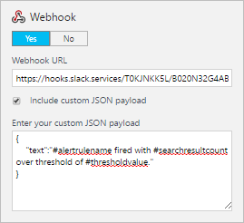

<properties
   pageTitle="Log Analytics alert webhook sample"
   description="One of the actions you can run in response to a Log Analytics alert is a *webhook*, which allows you to invoke an external process through a single HTTP request. This article walks through an example of creating a webhook action in a Log Analytics alert using Slack."
   services="log-analytics"
   documentationCenter=""
   authors="bwren"
   manager="jwhit"
   editor="tysonn" />
<tags
   ms.service="log-analytics"
   ms.devlang="na"
   ms.topic="article"
   ms.tgt_pltfrm="na"
   ms.workload="infrastructure-services"
   ms.date="10/27/2016"
   ms.author="bwren" />

# Webhooks in Log Analytics alerts

One of the actions you can run in response to a [Log Analytics alert](log-analytics-alerts.md) is a *webhook*, which allows you to invoke an external process through a single HTTP request.  You can read about details of alerts and webhooks in [Alerts in Log Analytics](log-analytics-alerts.md)

In this article, we’ll walk through an example of creating a webhook action in a Log Analytics alert using Slack which is a messaging service.

>[AZURE.NOTE] You must have a Slack account to complete this sample.  You can sign up for a free account at [slack.com](http://slack.com).

## Step 1 - Enable webhooks in Slack
2.	Sign in to Slack at [slack.com](http://slack.com).
3.	Select a channel in the **Channels** section in the left pane.  This is the channel that the message will be sent to.  You can select one of the default channels such as **general** or **random**.  In a production scenario, you would most likely create a special channel such as **criticalservicealerts**. <br>

	

3. Click **Add an app or custom integration** to open the App Directory.
3.	Type *webhooks* into the search box and then select **Incoming WebHooks**. <br>

	

4.	Click **Install** next to your team name.
5.	Click **Add Configuration**.
6.	Select the the channel that you're going to use for this example, and then click **Add Incoming WebHooks integration**.  
6. Copy the **Webhook URL**.  You'll be pasting this into the Alert configuration. <br>

	

## Step 2 - Create alert rule in Log Analytics
1.	[Create an alert rule](log-analytics-alerts.md) with the following settings.
    - Query: ```	Type=Event EventLevelName=error ```
    - Check for this alert every: 5 minutes
    - The number of results is: greater than 10
    - Over this time window: 60 minutes
    - Select **Yes** for **Webhook** and **No** for the other actions.
7. Paste the Slack URL into the **Webhook URL** field.
8. Select the option to **include a custom JSON payload**.
9. Slack expects a payload formatted in JSON with a parameter named *text*.  This is the text that it will display in the message it creates.  You can use one or more of the alert parameters using the *#* symbol such as in the following example.

    ```
    {
    "text":"#alertrulename fired with #searchresultcount records which exceeds the over threshold of #thresholdvalue ."
    }
    ```

	

9.	Click **Save** to save the alert rule.

10. Wait sufficient time for an alert to be created and then check Slack for a message which will be similar to the following.

	


### Advanced webhook payload for Slack

You can extensively customize inbound messages with Slack. For more information, see [Incoming Webhooks](https://api.slack.com/incoming-webhooks) on the Slack website. Following is a more complex payload to create a rich message with formatting:

	{
		"attachments": [
			{
				"title":"OMS Alerts Custom Payload",
				"fields": [
					{
						"title": "Alert Rule Name",
						"value": "#alertrulename"},
					{
						"title": "Link To SearchResults",
						"value": "<#linktosearchresults|OMS Search Results>"},
					{
						"title": "Search Interval",
						"value": "#searchinterval"},
					{
						"title": "Threshold Operator",
						"value": "#thresholdoperator"},
					{
						"title": "Threshold Value",
						"value": "#thresholdvalue"}
				],
				"color": "#F35A00"
			}
		]
	}


This would generate a message in Slack similar to the following.


## Summary

With this alert rule in place, you would have a message sent to Slack every time the criteria is met.  

This is only one example of an action that you can create in response to an alert.  You could create a webhook action that calls another external service, a runbook action to start a runbook in Azure Automation, or an email action to send a mail to yourself or other recipients.   

## Next Steps

- Learn about more about [alerts in Log Analytics](log-analytics-alerts.md) including other actions.
- [Create runbooks in Azure Automation](../automation/automation-webhooks.md) that can be called from a webhook.
