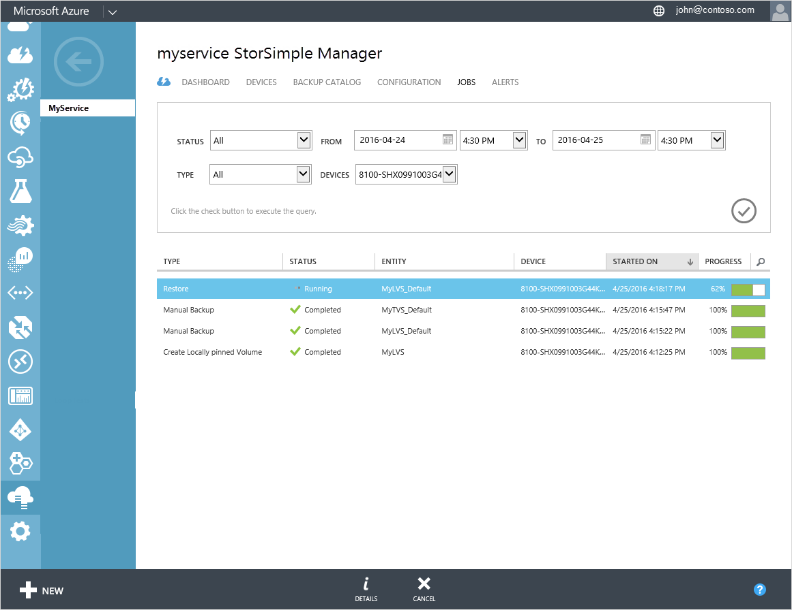

<properties 
   pageTitle="View and manage StorSimple jobs | Microsoft Azure"
   description="Describes the StorSimple Manager service Jobs page and how to use it to track recent, current, and scheduled backup jobs."
   services="storsimple"
   documentationCenter="NA"
   authors="alkohli"
   manager="carmonm"
   editor=""/>
<tags 
   ms.service="storsimple"
   ms.devlang="NA"
   ms.topic="article"
   ms.tgt_pltfrm="NA"
   ms.workload="TBD"
   ms.date="08/17/2016"
   ms.author="alkohli" />

# Use the StorSimple Manager service to view and manage StorSimple jobs (Update 2)

[AZURE.INCLUDE [storsimple-version-selector-manage-jobs](../../includes/storsimple-version-selector-manage-jobs.md)]

## Overview

The **Jobs** page provides a single central portal for viewing and managing jobs that were started on devices connected to your StorSimple Manager service. You can view scheduled, running, completed, canceled, and failed jobs for multiple devices. Results are presented in a tabular format. 

You can quickly find the jobs you are interested in by filtering on fields such as:

- **Status** – Jobs can be running, completed, canceled, failed, canceling, or completed with errors.
- **From and To** – Jobs can be filtered based on the date and time range.
- **Type** – The job type can be backup, manual backup, restore, clone, device failover, create locally pinned volume, modify volume, update, support package, or virtual device provisioning.

- **Devices** – Jobs are initiated on a certain device connected to your service.
The filtered jobs are then tabulated on the basis of the following attributes:

    - **Type** – backup, manual backup, restore, clone, device failover, create locally pinned volume, modify volume, update, support package, or virtual device provisioning.

    - **Status** – running, completed, canceled, failed, canceling, or completed with errors.

    - **Entity** – The jobs can be associated with a volume, a backup policy, or a device. For example, a clone job is associated with a volume, whereas a scheduled backup job is associated with a backup policy. A device job is created as a result of a disaster recovery (DR) or a restore operation.

    - **Device** – The name of the device on which the job was started.

    - **Started on** – The time when the job was started.

    - **Progress** – The percentage completion of a running job. For a completed job, this should always be 100%.

The list of jobs is refreshed every 30 seconds.

You can perform the following job-related actions on this page:

- View job details

- Cancel a job

## View job details

Perform the following steps to view the details of any job.

#### To view job details

1. On the **Jobs** page, display the job(s) you are interested in by running a query with appropriate filters. You can search for completed, running, or canceled jobs.

2. Select a job.

3. At the bottom of the page, click **Details**.

4. In the **Backup Job Details** dialog box, you can view the status, details, time statistics, and data statistics.
 
    

## Cancel a job

Perform the following steps to cancel a running job.

>[AZURE.NOTE] Some jobs, such as modifying a volume to change the volume type or expanding a volume, cannot be canceled.

### To cancel a job

1. On the **Jobs** page, display the running job(s) that you want to cancel by running a query with appropriate filters.

1. Select the job.

1. At the bottom of the page, click **Cancel**.

1. When prompted for confirmation, click **Yes**.

This job is now canceled.

## Next steps

- Learn how to [manage your StorSimple backup policies](storsimple-manage-backup-policies.md).

- Learn how to [use the StorSimple Manager service to administer your StorSimple device](storsimple-manager-service-administration.md).
