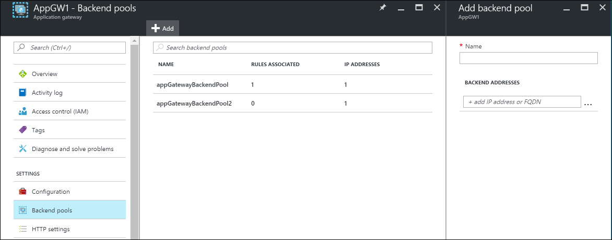
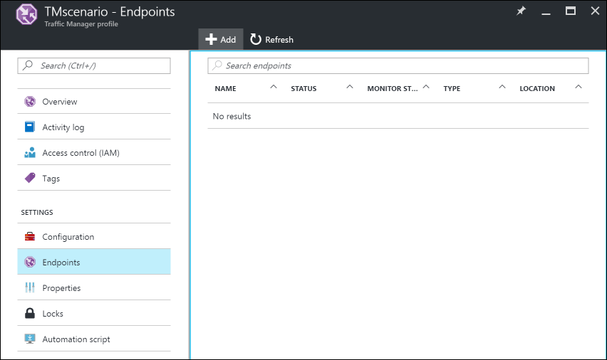
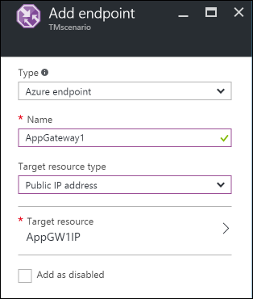

<properties
   pageTitle="Using Load Balancing Services in the Azure Cloud | Microsoft Azure"
   description="This tutorial shows you how to create a scenario using the Azure load-balancing portfolio: Traffic Manager, Application Gateway, and Load Balancer"
   services="traffic-manager"
   documentationCenter=""
   authors="liumichelle"
   manager="vitinnan"
   editor=""/>

<tags
   ms.service="traffic-manager"
   ms.devlang="na"
   ms.topic="article"
   ms.tgt_pltfrm="na"
   ms.workload="na"
   ms.date="10/27/2016"
   ms.author="limichel"/>

# Using Load Balancing Services in the Azure Cloud

## Introduction

Microsoft Azure provides multiple services for managing how network traffic is distributed and load balanced. You may use these services individually or combine their methods based on your specific needs and build the optimal solution.

In this tutorial, we first define a customer use case and see how it can be made more robust and performant using the following Azure load-balancing portfolio:  Traffic Manager, Application Gateway, and Load Balancer. We then provide step-by-step instructions for creating a deployment that is geographically redundant, distributes traffic to VMs, and provides abilities for managing different types of requests.

At a conceptual level, each of these services plays a distinct role in load balancing hierarchy.

1. **Traffic Manager** provides global DNS load balancing.  It looks at incoming DNS requests and responds with a healthy endpoint and in accordance with the routing policy the customer has selected. Options for routing methods are performance routing to send the requestor to the closest endpoint in terms of latency, priority routing to direct all traffic to an endpoint with other endpoints as backup, and weighted round robin routing, which distributes traffic based on weighting assigned to each endpoint. The client connects directly to that endpoint. Azure Traffic Manager detects when an endpoint is unhealthy and redirects the clients to another healthy instance. Refer to [Azure Traffic Manager documentation](traffic-manager-overview.md) to learn more about the service.
2. **Application Gateway** provides Application Delivery Controller (ADC) as a service, offering various Layer 7 load balancing capabilities for your application. It allows customers to optimize web farm productivity by offloading CPU intensive SSL termination to the Application Gateway. Other Layer 7 routing capabilities include round robin distribution of incoming traffic, cookie-based session affinity, URL path-based routing, and the ability to host multiple websites behind a single Application Gateway. Application Gateway can be configured as internet facing gateway, internal only gateway, or a combination of both. Application Gateway is fully Azure managed, scalable and highly available. It provides rich set of diagnostics and logging capabilities for better manageability.
3. **Load Balancer** is an integral part of the Azure SDN stack. Load Balancer provides high performance, low latency Layer 4 load balancing services for all UDP and TCP protocols.  It manages inbound and outbound connections.  You may configure public and internal load balanced endpoints and define rules to map inbound connections to backend pool destinations with TCP and HTTP health probing options to manage service availability.

## Scenario

In this example scenario, we use a simple website that serves two types of content: images and dynamically rendered webpages. This website needs to be geographically redundant and should serve its users from the closest (lowest latency) location to them. The application developer has decided any URLs that match the pattern /images/* are served from a dedicated pool of VMs different from the rest of the web farm.

Furthermore, the default VM pool serving the dynamic content needs to talk to a backend database hosted on a high availability cluster. The entire deployment is provisioned through Azure Resource Manager.

Utilizing Traffic Manager, Application Gateway and Load Balancer allow this website to achieve these design goals:

1. **Multi-geo redundancy**: By using Traffic Manager, if one region goes down, traffic is seamlessly routed to the next best region without any intervention from the application owner.
2. **Reduced latency**: Since the customer is automatically directed by Azure Traffic Manager to the closest region, they experience lower latency when requesting the webpage contents.
3. **Independent scalability**: By having the web application workload separated based on the type of content, the application owner can scale the request workloads independent of each other. Application Gateway ensures that the traffic gets routed to the right pools based on the rules specified and the health of the application health.
4. **Internal load balancing**: By having Load Balancer in front of the high availability cluster, only the respective active and healthy endpoint for a database is exposed to the application.  Further, a database administrator can optimize the workload by distributing active and passive replicas across the cluster independently of the frontend application.  Load Balancer delivers connections to the high availability cluster and ensure that only healthy databases are receiving connection requests.

The following diagram shows the architecture of this scenario:

> [AZURE.NOTE] This example is only one of many possible configurations of the load balancing services that Azure offers. Azure Traffic Manager, Application Gateway, and Load Balancer can be mixed and matched to best suit your load balancing needs. For example, if SSL offload or Layer 7 processing is not necessary, Load Balancer can be used in place of Application Gateway.

## Setting up the Load Balancing Stack

### Step 1: Create a Traffic Manager profile

1. Navigate to the Azure portal, click **New**, and search the marketplace for "Traffic Manager profile"
2. In the "Create Traffic Manager profile" blade, fill out the basic information for creating a traffic manager profile:

    - **Name** - gives your traffic manager profile a DNS prefix name
    - **Routing method** - select the traffic routing method policy, for more information about the methods, see [About Traffic Manager traffic routing methods](traffic-manager-routing-methods.md)
    - **Subscription** - the subscription that contains the profile
    - **Resource group** - the resource group to contain the traffic manager profile, it can be a new or existing resource group
    - **Resource group location** - Traffic Manager service is global and not bound to a location, however a region must be specified for the group where the metadata associated with the Traffic Manager profile resides. This location has no impact on the runtime availability of the profile.

3. Click **Create** to generate the traffic manager profile

### Step 2: Create the Application Gateways

1. Navigate to the Azure portal, and from the left-hand menu click **New** > **Networking** > **Application Gateway**
2. Next fill out the basic information about the application gateway. When complete click OK. The information needed for the basic settings is:

    - **Name** - The name for the application gateway.
    - **SKU size** - This setting is the size of the application gateway, available options are (Small, Medium, and Large).
    - **Instance count** - The number of instances, this value should be a number between 2 and 10.
    - **Resource group** - The resource group to hold the application gateway, it can be an existing resource group or a new one.
    - **Location** - The region for the application gateway, it is the same location at the resource group. The location is important as the virtual network and public IP must be in the same location as the gateway.

3. Next define the virtual network, subnet, frontend IP, and listener configurations for the application gateway. In this scenario, the frontend IP address is **Public** to allow it to be added as an endpoint to the Traffic Manager profile later on.
4. The next application gateway setting to configure is the listener configuration. If http is used, there is nothing left to configure and **OK** can be clicked. To use https further configuration is required, refer to [Create an Application Gateway](../application-gateway/application-gateway-create-gateway-portal.md), starting at Step 9.

#### Configure URL routing for Application Gateways

An application gateway configured with a Path-based rule takes a path pattern of the request URL in addition to round robin distribution when choosing the backend pool. In this scenario, we are adding a path-based rule to direct any URL with "/images/\*" to the image server pool. For more details on configuring URL path-based routing for an application gateway, refer to [Create a Path-based rule for an Application Gateway](../application-gateway/application-gateway-create-url-route-portal.md).

1. From your resource group, navigate to the instance of the Application Gateway created in the proceeding steps.
2. Under Settings select **Backend pools** and select Add to add the VMs that you want to associate with the web tier backend pools.
3. In the "Add backend pool" blade, enter the name of the backend pool and all the IP addresses of the machines residing in the pool. In this scenario, we are connecting two backend server pools of virtual machines.

    

4. Next under Settings of the application gateway, select **Rules**, and then click the **Path-based** button to add a new rule.

    

5. Within the "Add path-based rule" blade, provide the following information to configure the rule:

   - Basic Settings:
     * **Name** - a friendly name of the rule accessible in the portal
     * **Listener** - the listener used for the rule
     * **Default backend pool** - the backend pool to be used for the default rule
     * **Default HTTP settings** - the HTTP settings to be used for the default rule
   - Path-based rules:
     * **Name** - a friendly name of the path-based rule
     * **Paths** - the path rule used for forwarding traffic.
     * **Backend Pool** - the backend pool to be used with this rule
     * **Http Setting** - the HTTP settings to be used with this rule

    > [AZURE.IMPORTANT] Paths: Valid paths must start with "/". The wildcard "\*" is only allowed at the end. Valid examples are /xyz, /xyz\*, or /xyz/\*

    

### Step 3: Add Application Gateways to the Traffic Manager Endpoints

In this scenario, Traffic Manager is connected to instances of Application Gateway (as configured in the steps above) residing in different regions. Now that the Application Gateways are configured, the next step is to connect them to our Traffic Manger profile.

1. Navigate to your instance of the traffic manager profile (you can do this by looking within your resource group or searching for the name of the traffic manager profile from "All Resources").
2. From this blade, select **Endpoints** and then **Add** to add a new end point.

    

3. In the "Add endpoint" blade, fill out the information for creating a new endpoint

    - **Type** - the type of endpoint to load balance, in this scenario it is an Azure endpoint since we are connecting it to the Application Gateway instances configured above
    - **Name** - the name of end endpoint
    - **Target resource type** - select Public IP address, and in the 'Target resource' setting below, select the public IP of the Application Gateway configured above

    

4. From this point, you can test your setup by accessing it with the DNS of your traffic manager profile (in this example: TrafficManagerScenario.trafficmanager.net). You can resend requests, bring up/down VMs/Web servers created in different regions, and change the Traffic Manger profile settings to test your setup.

### Step 4: Create the Load Balancer

In this scenario, Load Balancer distributes connections from the web tier to the databases within a high availability cluster.

If your high availability database cluster is using SQL AlwaysOn, refer to Configure one or more [Always On Availability Group Listeners](../virtual-machines/virtual-machines-windows-portal-sql-ps-alwayson-int-listener.md) for step-by-step instructions.

For more details on configuring an internal load balancer, see [Create an Internal load balancer in the Azure portal](../load-balancer/load-balancer-get-started-ilb-arm-portal.md)

1. Navigate to the Azure portal, and from the left-hand menu click **New** > **Networking** > **Load balancer**
2. In the "Create load balancer" blade, choose a name for your load balancer
3. Set the **Type** to Internal, and choose the appropriate virtual network and subnet for the load balancer to reside in
4. Under **IP address assignment**, select either Dynamic or Static
5. Next under **Resource group**, choose the resource group for the load balancer
6. Under **Location**, choose the appropriate region for the load balancer
7. Finally, click **Create** to generate the load balancer

#### Connect backend database tier to Load Balancer

1. From your resource group, find the Load Balancer created in the steps above.
2. Under Settings, click **Backend pools** and then **Add** to add a new backend pool
3. In the "Add backend pool" blade, enter the name of the backend pool
4. From here, you can either add individual machines to the backend pool, or add an availability set to the backend pool.

   

#### Configure a probe

1. Under Settings of your load balancer, select **Probes** and then **Add** to add a new probe
2. In the "Add probe" blade, enter the **Name** for the probe
3. Select the **Protocol** for the probe. For a database, you likely want a TCP probe rather than an HTTP probe.   To learn more about Load Balancer probes, refer to [Understand load balancer probes](../load-balancer/load-balancer-custom-probe-overview.md).
4. Next, enter the **Port** of your database to be utilized when accessing the probe.
5. Under **Interval**, specify how frequently to probe the application
6. Under **Unhealthy threshold**, specify the number of continuous probe failures that must occur for the backend VM to be considered unhealthy.
7. Click **OK** to create the probe

   

#### Configure load balancing rules

1. Under Settings of your load balancer, select **Load balancing rules** and **Add** to create a rule
2. In the "Add load balancing rule" blade, enter the **Name** for the load balancing rule
3. Choose the **Frontend IP Address of the load balancer**, **Protocol**, and **Port**
4. Under **Backend port**, specify the port to be used in the backend pool
5. Select the **Backend pool** and the **Probe** created in the previous steps to apply the rule to
6. Under **Session persistence**, choose how you want the sessions to persist
7. Under **Idle timeouts**, specify the number of minutes before an idle timeout
8. Select either Disabled or Enabled for **Floating IP**
9. Click **OK** to create the rule

### Step 5: Connect web tier VMs to Load Balancer

Now we configure the IP address and Load Balancer frontend port in the applications running on your web-tier VMs for any database connections. This configuration is specific to the application that runs on these VMs. To configure the destination IP address and port, refer to the application documentation for these details. To find the IP address of the frontend, navigate to the Frontend IP pool on the Load Balancer settings blade in the Azure portal.

## Next steps

- [Overview of Traffic Manager](traffic-manager-overview.md)
- [Application Gateway overview](../application-gateway/application-gateway-introduction.md)
- [Azure Load Balancer overview](../load-balancer/load-balancer-overview.md)
