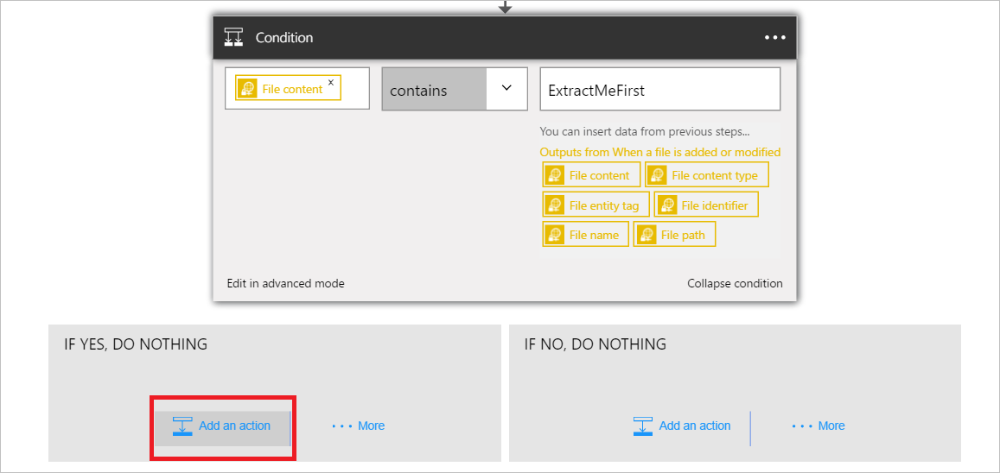

Now that you have added a trigger, its time to do something interesting with the data that's generated by the trigger. Follow these steps to add a the **SFTP - extract folder** action. This action will extract the contents of a file if the conditions defined are met. 

To configure the this action, you will need to provide the following information. You will notice that it is easy to use data generated  by the trigger as input for some of the properties for the new file:

|SFTP - extract folder property|Description|
|---|---|
|Source archive file path|This is the path for the file being extracted. You can select one of the tokens from an earlier action or browse the SFTP server to find the file path.|
|Destination folder path|This is the path where the extracted files will be placed. You can select one of the tokens from an earlier action as the destination path or browse the SFTP server and select a path.|
|Overwrite?|Indicates if a file with the same name as the extracted file is found in the destination folder path if the existing file should be overwritten or not.|

Let's get started adding the action to extract the files if the condition defined earlier evaluates to *True*. 

1. Select **Add an action**.        
   
- Select the **SFTP - Extract folder** action      
   
- Select **Source archive file path**              
   
- Select the **File path** token. This indicates that you will use the file path of the file that the trigger found as the source archive file path.           
   
- Select **Destination folder path**           
   
- Select the **File path** token. This indicates that you will use the file path of the file that the trigger found as the destination path for the extracted files.   
- Enter *\ExtractedFile* in the **Destination folder path** control. Do this just after the file path token in the Destination folder path control.         
   
- Enter *True* in the **Overwrite?* control to indicate that existing files should be overwritten if they have the same name as the extracted files.      
   
- Save the changes to your workflow  
