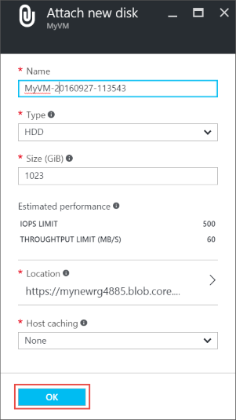
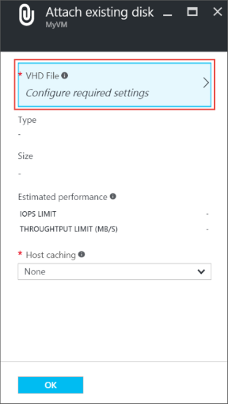

## Find the virtual machine

1. Sign in to the [Azure portal](https://portal.azure.com/).

2. On the Hub menu, click **Virtual Machines**.

3.	Select the virtual machine from the list.

4. To the Virtual machines blade, in **Essentials**, click **Disks**.

	

Continue by following instructions for attaching either a new disk or an existing disk.

## Option 1: Attach a new disk

1.	On the **Disks** blade, click **Attach new**.

2.	Review the default settings, update as necessary, and then click **OK**.

 	

3.	After Azure creates the disk and attaches it to the virtual machine, the new disk is listed in the virtual machine's disk settings under **Data Disks**.

## Option 2: Attach an existing disk

1.	On the **Disks** blade, click **Attach existing**.

2.	Under **Attach existing disk**, click **VHD File**.

	

3.	Under **Storage accounts**, select the account and container that holds the .vhd file.

	

4.	Select the .vhd file.

5.	Under **Attach existing disk**, the file you just selected is listed under **VHD File**. Click **OK**.

6.	After Azure attaches the disk to the virtual machine, it's listed in the virtual machine's disk settings under **Data Disks**.

